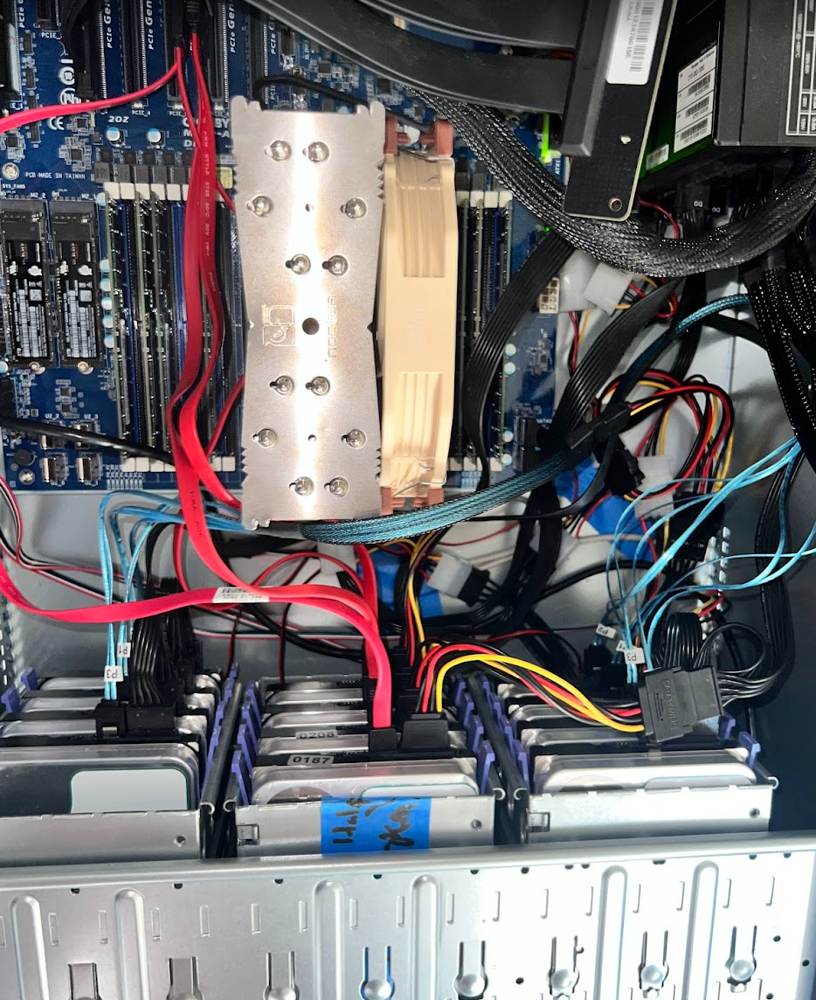
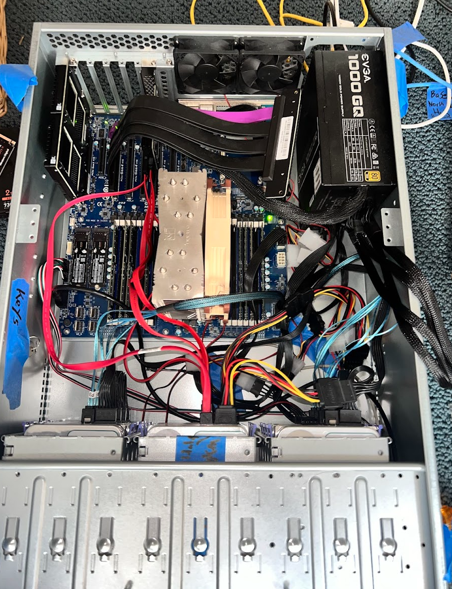
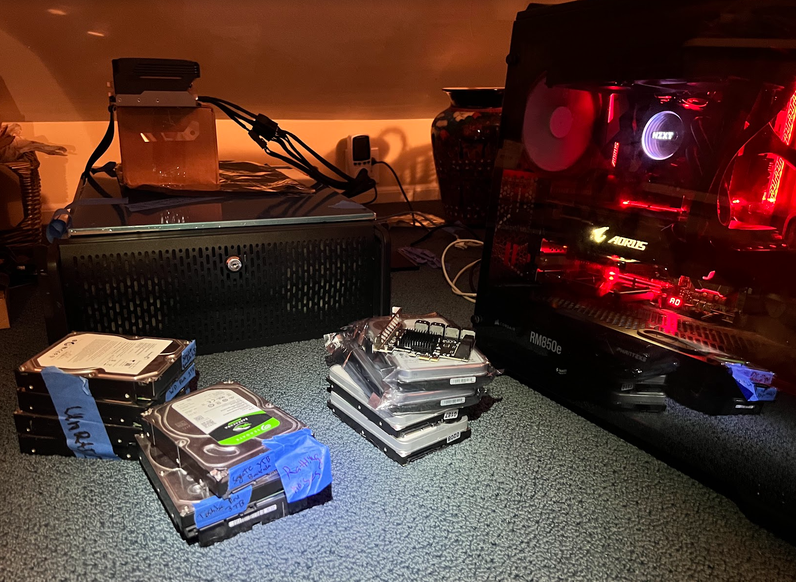
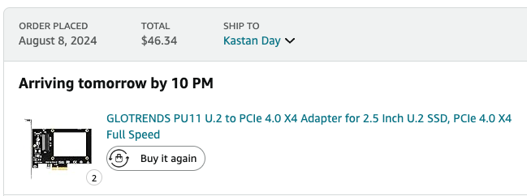
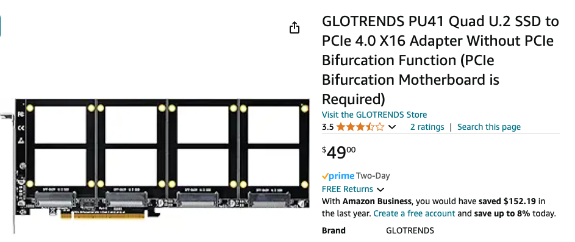
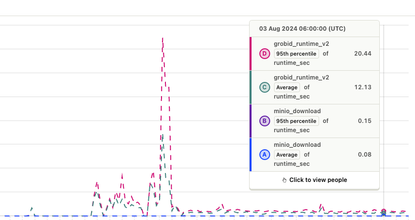
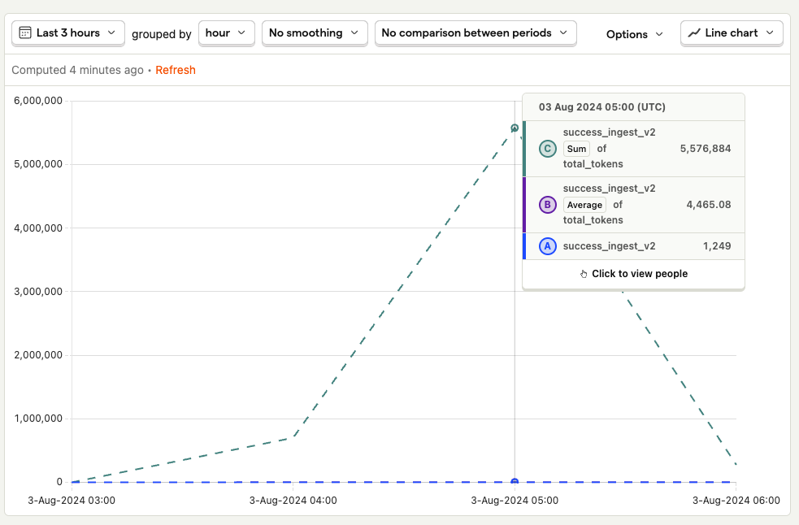

# Changelog

### Friday Aug 23

Meet with Amazon AICE research team.&#x20;

Tried and failed to configure ELK stack to use _**Elastic Fleet**_ to make it easier to connect external servers to the central ELK instance. Faced issues with TLS self signed certificates, even though I don't need or want TLS certs because I'm using Tailscale to connect services. It's a secure tunnel with automatic https, which removes the need for TLS certs.

### Thursday Aug 22

#### UIUC.chat

1. Several hours of pair programming with Drshika, our new hire. Nearly did an end-to-end feature implementation: support for Azure OpenAI models, with user-supplied API keys. Great on boarding session to our code base.&#x20;

### Wednesday, Aug 21

#### UIUC.chat

1. Onboarded two new devs to UIUC.chat using our brand-new [Developer Quickstart](https://docs.uiuc.chat/developers/developer-quickstart) docs, they worked flawlessly! Pretty slick.
2. Fixed [a critical production bug](https://github.com/KastanDay/ai-ta-frontend/pull/168). Did [incremental refactoring,](https://github.com/KastanDay/ai-ta-frontend/pull/167) the platonic ideal of production code.
3. Finally set up centralized log monitoring. Still WIP, need to add `filebeat` and `metricbeat` to other physical servers in our fleet.&#x20;
   1. 100% self hosted, because log-hosting companies have horrible pricing. My storage is cheap, nearly free, 10x better than hosted offerings. Therefore, worth the extra effort.

<figure><figcaption>
ELK Stack (Elasticsearch, Logstash, Kibana). All the 5 docker containers on a single server, viewable in a single browser! Finally.
</figcaption></figure>

### Tuesday, Aug 20

Infinite meetings on Tuesday. Updated stakeholders 😵‍💫

#### UIUC.chat

1. [Add secrets manager to backend.](https://github.com/UIUC-Chatbot/ai-ta-backend/commit/fb31cd04cc89f388900e1767e8008dfa737faff4) Add [docs for secrets manager.](https://docs.uiuc.chat/developers/developer-quickstart#backend-setup)
2. Fix Llama 3.1 context windows size.&#x20;
3. Fix automatic LLM selection function. Default to the best available model, with price tradeoffs.

### Monday, Aug 19

1. Did an incredible amount of Kubernetes debugging so I can self host the MMLI backend. Lots of PVCs and `kubectl apply`

### Sunday, Aug 18

#### Dotfiles refactor


Get the goodies here: [https://github.com/KastanDay/dotfiles](https://github.com/KastanDay/dotfiles)


1. Migrated my dotfiles from Gitlab to Github.&#x20;
2. Greatly refined all my install scripts and README.
   1. [My best `~/.ZSHRC`](https://github.com/KastanDay/dotfiles/blob/master/master-setup-scripts/.zshrc\_mac)
   2. [My favorite developer utilities and OhMyZsh plugins](https://github.com/KastanDay/dotfiles/blob/master/master-setup-scripts/install\_mac\_apple\_silicon.conf.yaml)
   3. [My delightful Mini-Mamba install scripts](https://github.com/KastanDay/dotfiles/tree/master/scripts)
3. Notable mentions:
   * `Powerlevel 10k` , greatest thing since sliced bread
   * `glances` - a better htop
   * `lsd` - a better ls
   * `bat` - a better cat
   * `fzf` - a better grep // excellent at reverse terminal search (command history search)
   * `ag` - a better find
   * some great OhMyZsh plugins
   * `miniconda`. Edit: actually `mini-mamba` , the faster version of conda developed by high frequency traders.

### Aug 15-16, 2024

#### UIUC.chat

* Extensive debugging of the Postgres database, it looks like a JSONB column in a table is causing `pg_dump -> pg_restore` to error out. Our guess is malfromed json snuck into the DB.&#x20;

#### Amazon AICE

* Synthetic data generation with [Distilabel](https://distilabel.argilla.io/). Implementing our filtering rules via their classes.&#x20;
* More manual data cleaning, removed a further 30 bad questions of our 800. Quality is everything. It's worth manual filtering for the 'last bit of ultra-high quality post-training data'.

#### Home servers

* Provisioned ZFS on mirrored Optane drives, passed through to the VM so the VM gets the raw performance of the Optane drives (instead of making a NFS share, which adds tons of latency and overhead).

### Aug 14, 2024

#### UIUC.chat&#x20;

See: [UIUC.chat Vision & Medium Term Plan](https://kastanday.notion.site/UIUC-chat-Vision-Medium-Term-Plan-b2f6dc4e1ae748798793909d579ff527?pvs=74)

* Group planning for automated `Metadata extraction` and `Insights` on UIUC.chat.&#x20;
  * Key ideas: structured outputs, creating charts and visualizations from user's documents, creating insights over multiple documents specifically `hierarchical summarization` and `contradiction identification`.

#### Servers

* Storage server: Installed 4x 18TB HDDs
  * It’s still much cheaper to DIY than anything else. Cloud is cheapest $7/TB/mo, and I can buy (raw) at $9/TB. So even at 9\*1.33 = 11.97 I’m still at under 2 month payback period.
* Web server: installed 2x 1TB Optane P905 U.2 drives.&#x20;
  * These are the lowest-latency drives ever made for random database access, e.g. Q-depth-1 (QD-1) reads from disk). Optane U.2 drives are extremely impressive as ZFS Special Metadata devices, now I'm provisioning a DB server with mirrored Optane drives. This setup (fast CPU, tons of DDR4 memory and Optane storage) be perfect for `qdrant` and `postgres` web serving.&#x20;

<figure><figcaption></figcaption></figure>

 

<figure><figcaption></figcaption></figure>

 

<figure><figcaption></figcaption></figure>

#### Paragliding

<figure><figcaption>
My first time flying. PooPoo point, WA.
</figcaption></figure>

### Aug 13, 2024

#### MMLI

* Fixed database initialization (was missing a secrets file, so I'm glad I asked for help).&#x20;
* Met with Bingji to plan frontend-backend integration. We wrote a spec for the two endpoints we need. It was a delightfully efficient meeting: as long as we agree on the API shape, we're good.&#x20;

#### UIUC.chat

* Merge Rohan's PR that [adds Tools and Llama 3 support to our API](https://github.com/KastanDay/ai-ta-frontend/pull/162).&#x20;
* Merge my PR [Improve Default Model on /chat page](https://github.com/KastanDay/ai-ta-frontend/pull/166)
  * Respect previous choices. E.g. the "last selected model" will attempt to be used, fallback to the preference list.
  * Respect enabled/disabled models when selecting the default
  * Bugfix: gpt-4o-mini can now be disabled, previously that one model bypassed checks.
* Redirect NCSA.ai -> UIUC.chat because it's now deprecated and superseded by UIUC.chat.

### Aug 12, 2024

#### [MMLI](https://moleculemaker.org/)

* Set up local Kubernetes cluster for new endpoint testing
* Encountered [challenges with database initialization](https://moleculemakerlabinst.slack.com/archives/C06RTMVEHLK/p1723501292044439)
* Refined input/output handling for MMLI backend integration with ACERetro
* 📜 Added comprehensive documentation: ["How to run locally with Docker and Minikube"](https://github.com/moleculemaker/mmli-backend/pull/59)

#### Research & Development

* Completed critical reading for LLM-Guided Retrieval work:
  * [GraphRAG](https://microsoft.github.io/graphrag/)
  * [HybridRAG](https://arxiv.org/abs/2408.04948)
  * [MedGraphRAG](https://arxiv.org/abs/2408.04187)
* [Check out my reading notes here.](https://kastanday.notion.site/GraphRAG-HybridRAG-MedRag-7d976804530f47e18eae4bbbfc25b973)

#### Administrative

* Handled extensive email and Slack communications
* UIUC.chat ([chat.illinois.edu](https://chat.illinois.edu/)) campus adoption progressing
  * Awaiting budget approval from Illinois CIO this week
* Gies expansion advancing successfully with professors Melanie Wiscount and Vishal Sachdev

#### Bug Fixes

* [Corrected URL references to `tools.uiuc.chat`](https://github.com/KastanDay/ai-ta-frontend/commit/2580641a4de33d7b0a5da11199e01e733230d92c) across UIUC.chat frontend

### Aug 9, 2024

#### Amazon AICE Research

* Manually cleaned 1,000 real user questions (90-minute process)
* Focused on retaining highest quality STEM questions
* Data cleaning process. Reduced dataset from 5,000 to 800 high-quality questions:
  1. De-duplication using longest common substring
  2. De-duplication near-match via embedding cosine similarity
  3. AI filtering for STEM-related questions
  4. Final manual human review
* Key takeaway: Quality > Quantity 🎯


Here's the full questions dataset (as `.jsonl`)


* [Molecule Maker Lab Institute (MMLI)](https://moleculemaker.org/): finished integrating the backend into [MMLI's custom Kubernetes job running framework](https://github.com/moleculemaker/mmli-backend/blob/main/app/routers/job.py#L58) (4+ hours). Basically, it'll take any docker image and any command and run that on the K8 cluster as a job. Pretty neat way to have one set of infra that runs many different docker images.&#x20;

### Aug 8, 2024

* Finalized Vyriad project allocations. This project should officially begin in 2 weeks, then I'll transition off of MMLI and onto this for 25% time.&#x20;
* Created this changelog so my team has greater visibility into how I spend my time.
* Setup Posthog monitoring of our Docs website traffic via GitBook integration. Our docs are getting really good, so I want to make sure people are finding them.
* UIUC.chat: support Ollama models in the API. Assist Rohan with adding Tools support to our API.&#x20;
  * [Significant refactor to improve maintainability](https://github.com/KastanDay/ai-ta-frontend/pull/162), especially RE our API. Now the /chat page and our internal API use the exact same functions to invoke a chat. Previously they were separate because we had one "client-centric implementation" and one "server-only implementation". Now we broke up the server-only part and call that from the client. No more duplicated code. Trivial support of new features, like Ollama and tool calling, in [our API](https://docs.uiuc.chat/api/endpoints).
  * [Upgrade from Clerk v4 to v5](https://github.com/KastanDay/ai-ta-frontend/pull/165) for new features (google "one tap" sign in), better designed components.&#x20;
  * Bugfix: gpt-4o-mini can now be disabled, previously that one model bypassed checks.
  * Logging: add Posthog logs to monitor the distribution of which LLM models are used.

### Aug 7, 2024

* Brought new home server online. It's designed to be a phenomenal single-purpose web server for UIUC.chat. It'll host our vector database (mostly in memory) and some of our helper docker containers, like our new secrets manager.&#x20;

<figure><figcaption>
Using mirrored (raid 1) Optane drives as the boot drive, and main database host. This should make Q-depth 1 database lookups extremely low latency, and extremely high IOPs. It should be about 6x faster than the best M2 SSDs. I've had great experiences using Optane 905P as a special metadata device for ZFS, and now I'm doing the same for my vector databases.
</figcaption></figure>

<figure><figcaption>
This server is using a consumer platform, i.e. Intel 8700K that turbos to 5 GHz clock speeds, quite meaningful single core performance even today (~6 years later). But consumer motherboards don't typically support PCI-e bifurcation 😭 so I had to buy 2x these U.2 -> PCI-e adaptors for the drives. 
</figcaption></figure>

<figure><figcaption>
On my EPYC server I use this with 4x Optane 905P U.2 for ZFS "Special Metadata" devices. 2x mirrors of RAID-1 because I value redundancy these days. <a href="https://www.amazon.com/dp/B0D3XX7PSF">https://www.amazon.com/dp/B0D3XX7PSF</a>
</figcaption></figure>

* New secrets manager, [Infisical](https://infisical.com/), like Bitwarden for Devs with .env secrets. It's delightful to self host. It's here: [env.ncsa.ai](https://env.ncsa.ai). It enables a delightful developer experience, no more shipping around .env files via Slack!&#x20;
  * Light refactor of our frontend and backend repo to automatically use the secrets manager. just do `npm run dev` and your secrets are auto-injected (so log as you login with our secrets CLI tool). It's actually great.&#x20;
* Wrote [fantastic developer onboarding docs](https://docs.uiuc.chat/developers/developer-quickstart) for UIUC.chat contributors. Primarily for our new HPC-GPT project, funded by NSF CSSI.&#x20;

### Aug 6, 2024

* Spent a few hours to get Grobid running on Delta. I used a `gradle` build instead of Docker/Apptainer.
  * UPDATE (Aug 8): I got [apptainer working, thanks to the devs on github](https://github.com/kermitt2/grobid/issues/1150).
  * Wrote a script to automatically port forward all the way from my personal server to an _active Delta_ _compute node._ This enables me to run Grobid as a web server and make API requests against it.&#x20;
  * Next: write a script to create a reverse proxy against a pool of Delta compute nodes to enable multi-node scaling of my ingest process. On a single node my job might take a month of CPU-node-hours. So, I need \~30x parallel nodes to do it in a day.&#x20;
* [Spent many hours over the weekend (August 4th) on adding Posthog logging](https://github.com/UIUC-Chatbot/ai-ta-backend/pull/255) to this process, now I have beautiful dashboard to track my overall speeds (avg and 95% latencies). Good monitoring is fundamental to my mission of increasing speed.&#x20;

<figure><figcaption>
Grobid processing time.
</figcaption></figure>

 

<figure><figcaption>
Overall PDFs per second of the parallel ingest.
</figcaption></figure>

